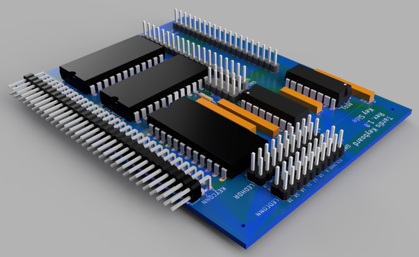
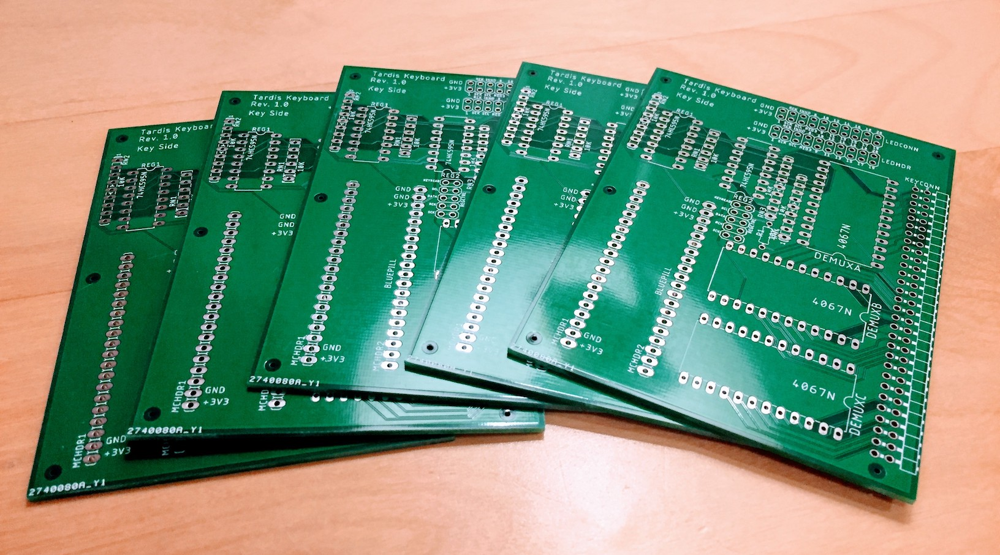
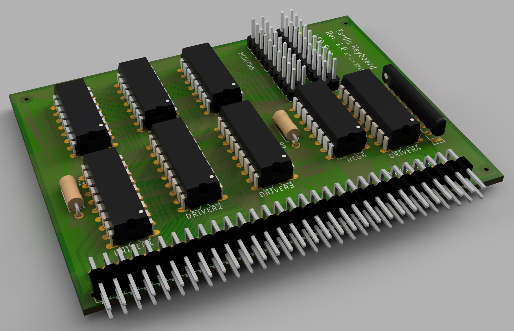

# Keyboard Controller

There was always a chance that I wouldn't be able to get the original hardware to work, so from the very beginning I planned on designing a keyboard controller to drive the key matrix PCB and connect it to my computer as a USB HID device, bypassing the original logic board altogether. There are two pieces to the controller: the key matrix scanner and the LED driver.

## Key Matrix Scanner

The key matrix scanner is the brains of the operation. The parallel rows of pins in the back left in the image above is for mounting a "Blue Pill" STM32F103CT6 microcontroller. The only traces connected to those pins are +3V3 and GND. The microcontroller communicates with the board by the 5X2 pin header right at the center of the board. As a consequence of this design, it is trivial to use a different microcontroller with the board. Only 5 of those pins need to connect to the MCU; the other 5 pins are to tap into the lines for debugging or expansion. The 60 pin right angle header connects to the ribbon cable that goes to the key button PCB. Without the LED board attached, the Blue Pill can scan the entire key matrix in ~220 microseconds, or ~4,500 times a second. This is far faster than necessary. What's more, the scanning can be offloaded to the SPI and DMA hardware, freeing the STM32 to do other tasks.

The dual 10X2 pin headers on the right side allow the key matrix scanner board to connect to the LED driver board through a 20 pin ribbon cable. Again, only one of the two 10X2 pin headers is required. The second header is for debugging or expansion. 

Here's the unsoldered custom PCB:

## LED Driver

The LED driver board also has dual 10X2 headers, with the second header just a duplicate of the first. The abundance of unused pins on the 10X2 header leaves plenty of room for further expansion. The LEDs can be driven at ~400 KHz. Brightness can be controlled dynamically by varying the duty cycle (PWM).

## Connectivity

The Blue Pill has a micro USB port and will appear as a USB keyboard. Other setups are possible. For example, an ESP32 would provide Bluetooth and possibly USB as well and would be very power efficient. However, hardware support is farther away for the ESP32.