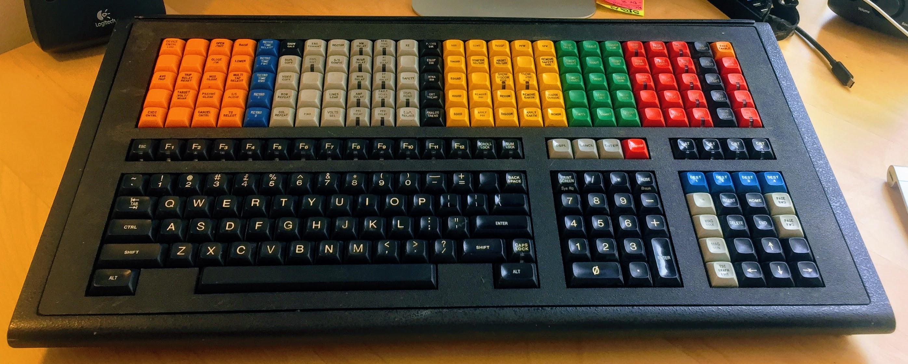

# The Tardis Keyboard Computer:  Project Smurd

For more information about Project Smurd, see [Keyboard Notes.md](./Keyboard%20Notes.md).

## Contents

- Arduino - Microcontroller source code to drive the key matrix scanner.
- Photos - Various photos of the device and its components. 
  - TardisBuilders - Photos of another keyboard of the same model.
- Circuit Reverse Engineering - Identification and wiring of the electronic components
  - Button Matric PCB - The PCB onto which the keys are soldered is completely reverse engineered
  - Logic Board Labelled - Electronic components on the logic board are identified
  - Logic Board Wiring - A mostly complete trace route identification of the logic board
- EEPROM - The contents of the persistent data storage of the device.
  - `Empros 8830-101 (ROM No 56600413 27, Aug 1992), U4 EPROM` - The raw binary dump of the EEPROM
  - `Empros 8830-101 (ROM No 56600413 27, Aug 1992), U4 EPROM.dump` - A "hex dump" of the data
  - KeyboardOS - Artifacts from Ghidra
    - `disassembly.html` - Human-readable disassembly of the Z80 machine code
    - `decompiled_c.html` & `decompiled.c` - Ghidra's decompilation to C.
    - `KeyboardOS.gpr` - Ghidra project file
    - `KeyboardOS.rep` - Ghidra's internal files, not human readable

## Device Information

|                      |                                                              |                                                              |
| -------------------- | ------------------------------------------------------------ | ------------------------------------------------------------ |
| Manufacturer         | Control Data Corporation and and Empros Systems International | "CDC's Energy Management Division was one of its most successful business units, providing control systems solutions that managed as much as 25% of all electricity on the planet. In 1988 or 1989, this division was renamed Empros and was later sold to Siemens as CDC broke apart.[[28\]](https://en.wikipedia.org/wiki/Control_Data_Corporation#cite_note-29)" |
| Manufactured For     | The National Grid Company plc Contract No. FCGCP/-/I1080  | "Intended For..."                                            |
| Name(s)              | Operations Keyboard, Keyboard NGC                            | The same across at least two keyboards.                      |
| Equipment ID NO.     | Multiple: CA312B, QSE 36444                                  | The same across at least two keyboards.                      |
| Part Number          | Multiple: 56598681, 56599470                                 | The same across at least two keyboards. Part numbers found within the device and on the EEPROM have the form 5659XXXX. |
| HPC/EC NO.           | 56598681                                                     | The same across at least two keyboards.                      |
| Series Code          | 01                                                           | The same across at least two keyboards.                      |
| Product Model        | 8830-101                                                     | The same across at least two keyboards.                      |
| Known serial numbers | 1037, 1046                                                   |                                                              |
| Firmware             | ROM PART NUMBER IS 56600413 27 AUG 1992                      | Data embedded in EEPROM.                                     |
| Installation Date    | 24/9/92 for serial numbers 1037 & 1046                       | Installed by A. Williams?                                    |
| Additional ID        | 56598203 E EM 9146                                       | Small sticker on back, top. The same across at least two keyboards. |

